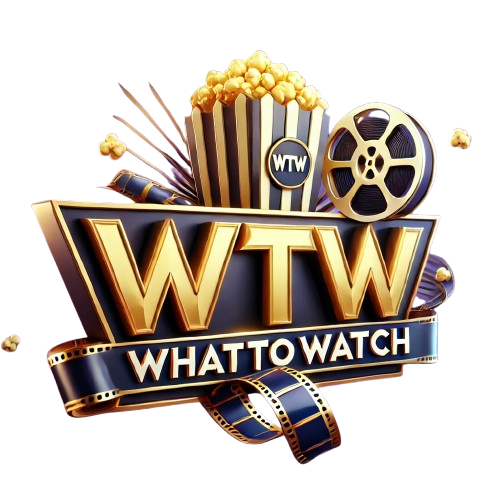

<p align="center">
  
</p>

🎬 WhatToWatch
==============

**WhatToWatch** is a React 19 movie browsing application that helps users find the perfect movie to watch based on filters like genre, rating, and year. It uses the **TMDB API** for movie data and **Appwrite** as database to track trending movies based on search popularity.

🌟 Features
-----------

✅ **Trending Section** -- Movies gain popularity as users search for them.\
✅ **All Movies Section** -- Browse through a wide collection of movies.\
✅ **Smart Search** -- Every search increases a movie's trending score.\
✅ **Advanced Filters** -- Filter movies by:

-   **Genre** (Action, Comedy, Drama, etc.)
-   **Rating** (e.g., only movies rated 7+)
-   **Year** (Find movies from a specific year)
 
✅ **Pagination** -- Easily navigate through large movie lists.\
✅ **IMDB Links** -- Each movie directly links to its IMDb profile for more details.

🚀 Tech Stack
-------------

-   **React 19** -- Modern, efficient frontend framework
-   **Tailwind 14** -- Utility-first CSS for sleek styling
-   **Appwrite** -- Database and backend services
-   **TMDB API** -- Source for movie data
-   **Render** -- Hosting and deployment

🎨 The Vision
-------------

Originally based on a YouTube tutorial, the app was limited to basic search and trending functionalities. I expanded it by implementing **filters, pagination and IMDB links**, turning it into a practical tool for movie discovery. Now, users can easily find movies matching their exact preferences.

🖼️ Logo & Branding
-------------------

The app's logo was AI-generated to reflect a modern, engaging movie discovery experience.

🌐 Live Demo
-------------------------

🔗 **Live App:** [WhatToWatch on Render](https://whattowatch-vpkr.onrender.com/)\

📌 Installation & Usage
-----------------------

1.  Clone the repository:

    ```
    git clone https://github.com/paunovgeorgi/WhatToWatch.git
    cd WhatToWatch

    ```

2.  Install dependencies:

    ```
    npm install

    ```

3.  Set up environment variables:
    -   Create a `.env` file and add your **TMDB API key** and **Appwrite credentials**.
4.  Start the development server:

    ```
    npm run dev

    ```

5.  Open <http://localhost:3000> in your browser.

🛠️ Future Improvements
-----------------------

-   User authentication for personalized watchlists
-   Light mode for better UX
